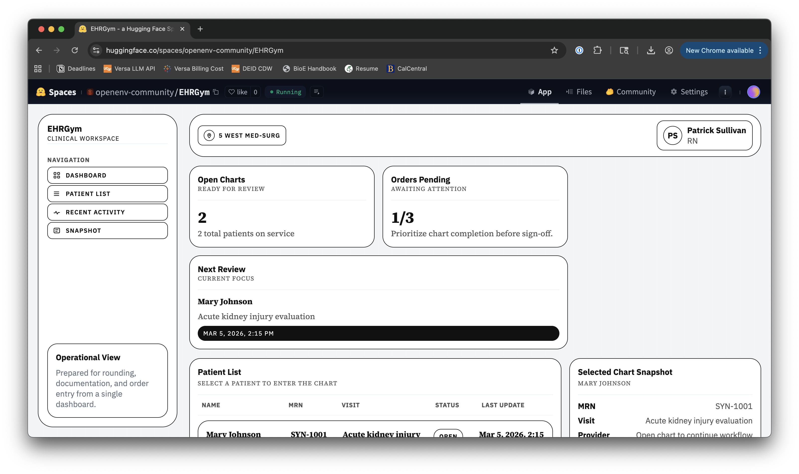

# EHRGym

<p align="center">
  
</p>

<p align="center">
  <a href="https://huggingface.co/spaces/openenv-community/EHRGym"></a>
  <a href="https://huggingface.co/docs/trl/grpo_trainer"></a>
  <a href="https://colab.research.google.com/github/adtserapio/EHRGym/blob/main/notebooks/ehrgym_grpo_training.ipynb"></a>
  <a href="LICENSE"></a>
</p>

**EHRGym** is an [OpenEnv](https://huggingface.co/openenv-community)-compatible environment for training and evaluating computer-use agents in an Epic-like electronic health record (EHR) workflow. It integrates natively with [TRL](https://github.com/huggingface/trl)'s `GRPOTrainer` for GRPO fine-tuning.

<p align="center">
  <a href="https://huggingface.co/spaces/openenv-community/EHRGym">
    
  </a>
</p>

<p align="center">
  <a href="https://huggingface.co/spaces/openenv-community/EHRGym">🤗 Try the environment out on Hugging Face Spaces</a>
</p>

It combines:

- A web-based EHR built with **Next.js + TypeScript**  
- An **OpenEnv-compliant environment server** built with **FastAPI + Playwright**

The environment exposes `reset()`, `step(action)`, and a `state` object so an agent can interact with the EHR through a real browser.

> **Note:** This project uses **synthetic data only** (no PHI).  
> Not affiliated with or endorsed by Epic Systems.

---

## Table of contents

- [Clinical focus (initial)](#clinical-focus-initial)
- [What you get](#what-you-get)
- [Goals](#goals)
- [Non-goals (initial)](#non-goals-initial)
- [Architecture (one environment instance)](#architecture-one-environment-instance)
- [EHR UI layout (Epic-like)](#ehr-ui-layout-epic-like)
- [OpenEnv interface](#openenv-interface)
- [Tasks (provider-focused)](#tasks-provider-focused)
- [Synthetic patients](#synthetic-patients)
- [Performance & training approach](#performance--training-approach)
- [Logging & evaluation](#logging--evaluation)
- [Repository layout (proposed)](#repository-layout-proposed)
- [Quickstart (placeholder)](#quickstart-placeholder)
- [GRPO Training with TRL](#grpo-training-with-trl)
- [Contributing](#contributing)
- [License](#license)

---

## Clinical focus (initial)

Provider workflows:

- Reviewing the chart (encounters, labs, prior notes)  
- Writing progress and encounter notes  
- Placing and signing orders

---

## What you get

- **Epic-like charting UI**
  - Chart Review (Encounters / Labs / Clinical Notes)
  - Notes authoring
  - Orders with signing workflow
  - Encounter sign/close

- **OpenEnv-compliant RL environment**
  - Typed `Action`, `Observation`, `State`
  - `reset()` / `step()` / `state()`
  - Real browser interaction (Playwright)

- **Task library**
  - Chart review → note → orders → sign/close

- **Synthetic patient pipeline**
  - Baseline: **Synthea + FHIR-shaped ingest**

---

## Goals

- OpenEnv compliance with typed `Action` / `Observation` / `State` models  
- Docker-first deployment and reproducible containers  
- Next.js EHR interface supporting:
  - chart review (encounters, labs, clinical notes)
  - order entry (labs / meds / imaging) with sign workflow
  - note authoring (progress & encounter notes)
- Task-based RL episodes (patient + scenario + objective + scoring rubric)  
- Synthetic patients only (no PHI), with realistic longitudinal timelines and standard coding where feasible

---

## Out-of-Scope

- Pixel-perfect Epic cloning (We emulate workflows & info layout)  
- Full enterprise EHR scope on day one (MAR, billing, scheduling, in-basket, prior auth, etc.)

---

## Architecture

A single container runs two processes:

1. **Next.js EHR app (port 3000)**
   - Serves the UI and required API routes (patient data, notes, orders, signing)
2. **OpenEnv environment server (port 8000)**
   - FastAPI server exposing OpenEnv API
   - Launches and controls headless Chromium via Playwright
   - Implements `reset()`, `step()`, `state`, scenario sampling, and reward computation

**Data layer**
- SQLite via Prisma (portable and fast)  
- On `reset()`, the environment recreates/truncates the DB and reseeds patients, encounters, labs, notes, orders, and scenario ground truth. Optionally use a DB snapshot + copy-on-reset for speed.

---

## EHR UI layout (Epic-like)

- **Entry view:** patient list / schedule-like page → select patient → open chart  
- **Chart shell**
  - Activity sidebar: Summary, Chart Review, Orders, Notes (optional), Encounter (close/sign)
  - Patient banner: synthetic demographics and key flags (synthetic ID, age/sex, allergies)
- **Chart Review tabs**
  - Encounters: timeline, encounter detail, linked notes/orders
  - Labs: table + trend view, filtering, abnormal flags
  - Clinical Notes: list by type/date/author, open note
- **Notes**
  - Create Progress Note tied to current encounter
  - Structured sections (SOAP)
  - Problem-oriented A/P that links naturally to orders
- **Orders**
  - Search/select from constrained preference list
  - Configure parameters (dose/frequency, lab timing)
  - Statuses: Draft → Pending Signature → Signed

**RL instrumentation**
- Stable selectors (`data-testid` / `data-qa`) for tabs, lab rows, order rows, note controls  
- Accessible labels (`aria-label`) so agents can use the accessibility tree

---

## OpenEnv Interface

**Actions**
- Low-level computer-use actions (mouse clicks, drag, scroll, keypress, type, wait)
- Optional high-level actions for curriculum/debug (e.g., `click(selector)`, `fill(selector,text)`, `goto(path)`, `select_patient(patient_id)`)

**Observations**
- Goal/instruction text
- Downscaled screenshot (base64 PNG)
- Current route/URL and active activity context
- Optional DOM snapshot and/or accessibility tree
- Metadata (timing, action success, structured errors)

**State**
- `episode_id`, `step_count` + environment fields:
  - `patient_id`, `encounter_id`, `scenario_id`
  - `rubric_progress`
  - `cumulative_reward`

**Rewarding**
- Terminal success when objective is satisfied (e.g., correct note signed + correct orders signed)  
- Shaping rewards for meaningful substeps (navigate, find target lab, place required order, sign)  
- Penalties for invalid actions, navigation errors, unsafe/irrelevant orders, excessive steps

---

## Tasks

Scenarios are packaged as specs and optionally generated at reset. Example task families:

- **Chart Review → Labs**
  - Find most recent creatinine; evaluate AKI criteria
  - Trend hemoglobin over last 3 values; document in progress note
- **Chart Review → Encounters**
  - Locate discharge summary; extract follow-up plan
  - Identify prior antibiotic exposure from previous encounter orders
- **Clinical Notes**
  - Open most recent consult; summarize recommendations
- **Progress note authoring**
  - Complete SOAP note with required elements and grounded facts
- **Orders**
  - Place specific orders with correct parameters; sign
- **Close/finish encounter**
  - Signed note + signed orders + required fields

**Curriculum**
- Phase 0: unit skills (navigate, open tabs, filter labs, open note)  
- Phase 1: single objective (place one order, sign one note)  
- Phase 2: multi-step (review → note → orders → sign/close)

---

## Synthetic patients

Baseline approach:

- Use Synthea to generate longitudinal synthetic records (encounters, conditions, meds, labs/vitals, procedures, etc.), exportable as FHIR  
- Treat FHIR R4 concepts as the internal “shape” even if stored relationally  
- Use standard coding when feasible:
  - LOINC for labs
  - SNOMED CT for problems/findings/procedures
  - RxNorm for meds

**Notes gap (free-text)**
- Template-based notes from structured facts (easy to score, less diverse)  
- Constrained LLM-generated notes grounded strictly in chart facts (more realistic, needs guardrails)  
- Hybrid: deterministic skeleton + constrained paraphrase

**Scenarios** layer on top of base patients as teaching cases (e.g., DKA, CHF, pneumonia, AKI, GI bleed) with explicit ground truth objectives:
- required orders
- required note elements
- critical facts that must appear in the note

---

## Performance and Training Approach

- Browser simulation throughput is usually the bottleneck, not GPU  
- Start with demonstrations (scripted Playwright expert) → supervised behavioral cloning  
- Move to RL after BC reliably solves simpler tasks  
- Run a modest number of env containers concurrently (e.g., 4–16)  
- Keep observations efficient (downscale screenshots; optionally omit DOM/a11y on “easy mode”)

---

## Logging and Evaluation

**Logging per step**
- Action, success/failure, reward components, UI errors

**Episode artifacts**
- Final note text
- Orders placed/signed
- Optional screenshots for debugging

**Evaluation**
- Deterministic test suites with fixed seeds  
- Metrics: task success rate, steps-to-completion, unsafe/irrelevant order rate, note completeness/grounding

**Safety**
- Synthetic data only (no PHI)  
- Constrained formulary and order catalog  
- If LLM-generated notes are used, enforce grounding checks (facts must be supported by chart)

---

## Repository layout

```
apps/ehr/            Next.js EHR UI (TypeScript)
ehrgym/              OpenEnv Python client + TRL reward functions
notebooks/           Starter notebook for GRPO training
env_server/          FastAPI OpenEnv server + Playwright control
tasks/               scenario specs, rubrics, fixtures (25 tasks)
configs/             GRPO training configs (YAML + DeepSpeed)
scripts/             TRL training script, agents, trajectory tools
prisma/              schema + migrations
docker/              Dockerfiles + entrypoints
shared/              synthetic seed definitions + reset helpers
synthetic/           Synthea generation + FHIR ingest + seed tooling
```

---

## Quickstart

The initial scaffold is now wired end-to-end.

### What is included

- **Next.js EHR UI** in [apps/ehr](apps/ehr)
  - patient list / chart entry
  - chart review with encounters, labs, notes
  - progress note authoring
  - order drafting and signing
  - encounter sign workflow
- **FastAPI environment server** in [env_server](env_server)
  - `POST /reset`
  - `POST /step`
  - `GET /state`
  - `GET /healthz`
- **Prisma + SQLite** schema and seed data in [prisma](prisma) and [shared](shared)
- **Docker** single-container startup files in [docker](docker) and [docker-compose.yml](docker-compose.yml)

### Local development

Prerequisites:

- Node.js 20+
- Python 3.9+

1. Install Node dependencies:

  `npm install`

2. Install the Python environment server package:

  `python3 -m pip install .`

  If you use a virtual environment or conda environment, activate it before running the remaining commands.

3. Install the browser runtime for Playwright:

  `python3 -m playwright install chromium`

4. Copy environment variables if needed:

  `cp .env.example .env`

5. Initialize the SQLite database:

  `npx prisma generate && npx prisma db push && npx prisma db seed`

6. Start both processes:

  `npm run dev`

Available endpoints:

- EHR UI: http://127.0.0.1:3000
- Env server: http://127.0.0.1:8000

### Docker

Build and run the combined container:

`docker compose up --build`

This launches:

- the Next.js EHR app on port `3000`
- the FastAPI environment server on port `8000`

### Minimal API flow

1. `POST /reset`
2. Read `observation` and `state`
3. Send browser-style actions to `POST /step`
4. Inspect `GET /state` for episode progress

A starter agent loop is included in [scripts/example_agent.py](scripts/example_agent.py).

### Demo tooling

For offline trajectory replay and remote VLM rollouts over SSH, see [docs/remote-vlm-demo.md](docs/remote-vlm-demo.md).

For offline dataset creation and SFT preparation, see [docs/offline-training.md](docs/offline-training.md).

---

## GRPO Training with TRL

EHRGym integrates with TRL's `GRPOTrainer` using the [OpenEnv](https://huggingface.co/docs/trl/openenv) `rollout_func` pattern for agent training. The model learns to navigate the EHR, place orders, write notes, and sign encounters through multi-turn browser interaction.

### Starter notebook (recommended)

The fastest way to get started is the end-to-end training notebook:

[](https://colab.research.google.com/github/adtserapio/EHRGym/blob/main/notebooks/ehrgym_grpo_training.ipynb)

The notebook covers:
- Connecting to the hosted EHRGym Space (zero setup)
- Defining a `rollout_func` with `generate_rollout_completions` for multi-turn EHR interaction
- Three reward signals: clinical rubric, action format, and step efficiency
- Training with vLLM-accelerated GRPO on Qwen3-1.7B
- Evaluating the fine-tuned model on clinical tasks

See [`notebooks/ehrgym_grpo_training.ipynb`](notebooks/ehrgym_grpo_training.ipynb) for the full walkthrough.

### Quick start (CLI)

```bash
# 1. Start the EHRGym environment
npm run dev

# 2. Install training dependencies
pip install "trl[vllm]" git+https://github.com/adtserapio/EHRGym.git

# 3. Run GRPO training (single GPU, smoke test)
python scripts/train_grpo_trl.py \
    --model_name_or_path Qwen/Qwen3-0.6B \
    --output_dir runs/checkpoints/ehrgym-grpo-trl \
    --max_steps 50 \
    --num_generations 2 \
    --max_completion_length 512
```

### With vLLM acceleration

```bash
accelerate launch \
    --config_file configs/deepspeed_zero2.yaml \
    scripts/train_grpo_trl.py \
    --model_name_or_path Qwen/Qwen3-1.7B \
    --output_dir runs/checkpoints/ehrgym-grpo-trl \
    --use_vllm True \
    --vllm_mode colocate \
    --max_steps 500 \
    --num_generations 4 \
    --max_completion_length 1024 \
    --report_to wandb
```

### Using the config file

```bash
python scripts/train_grpo_trl.py --config configs/grpo_ehrgym.yaml
```

### Python API (rollout_func pattern)

```python
from ehrgym import EHRGymEnv
from trl import GRPOTrainer, GRPOConfig
from trl.experimental.openenv import generate_rollout_completions

def rollout_func(prompts, trainer):
    # For each prompt, run a full EHR episode
    # Parse model outputs into browser actions (navigate, click, type, press)
    # Step through the environment and collect rewards
    # Return prompt_ids, completion_ids, logprobs, env_mask, and reward fields
    ...

trainer = GRPOTrainer(
    model="Qwen/Qwen3-1.7B",
    reward_funcs=[reward_task, reward_format, reward_efficiency],
    train_dataset=dataset,
    args=GRPOConfig(
        max_completion_length=4096,
        use_vllm=True,
        vllm_mode="colocate",
    ),
    rollout_func=rollout_func,
)
trainer.train()
```

For the complete `rollout_func` implementation with `env_mask` and multi-turn interaction, see the [starter notebook](notebooks/ehrgym_grpo_training.ipynb).

### Architecture

```
┌─────────────────────────────────────────────────────┐
│  Training (GPU Machine)                             │
│  ┌───────────────────────────────────────────────┐  │
│  │  TRL GRPOTrainer                              │  │
│  │  ┌─────────┐  ┌───────────┐  ┌────────────┐  │  │
│  │  │  Model   │→ │ Tool Calls │→ │ EHRGymEnv  │  │  │
│  │  │ (Qwen3) │← │ (navigate, │← │ (HTTP      │  │  │
│  │  │         │  │  click,    │  │  client)   │  │  │
│  │  │         │  │  type_text,│  │            │  │  │
│  │  │         │  │  press_key)│  │            │  │  │
│  │  └─────────┘  └───────────┘  └──────┬─────┘  │  │
│  └──────────────────────────────────────┼────────┘  │
└─────────────────────────────────────────┼───────────┘
                                          │ HTTP
┌─────────────────────────────────────────┼───────────┐
│  EHRGym Server (Docker / HF Space)      │           │
│  ┌──────────────────────────────────────┼────────┐  │
│  │  FastAPI env server (:8000)          ▼        │  │
│  │  /reset  /step  /state                        │  │
│  │  ┌────────────────────────────────────────┐   │  │
│  │  │  Playwright (headless Chromium)        │   │  │
│  │  │  → Next.js EHR app (:3000)            │   │  │
│  │  └────────────────────────────────────────┘   │  │
│  └───────────────────────────────────────────────┘  │
└─────────────────────────────────────────────────────┘
```

### 25 Clinical Tasks

The environment ships with 25 clinical tasks across three difficulty levels:

| Difficulty | Tasks | Notes | Rubric Items |
|------------|-------|-------|--------------|
| Basic      | 8     | 3     | ~5           |
| Medium     | 9     | 4-5   | ~10          |
| Hard       | 8     | 6-7   | ~10          |

Tasks include AKI, DKA, pneumonia, CHF, COPD, stroke, GI bleed, PE, sepsis, and more.

---

## Contributing

- Keep all data synthetic  
- Add `data-testid` / `aria-label` for any new interactive UI element  
- New tasks should include:
  - objective text
  - ground truth artifacts (required orders/note fields)
  - rubric scoring rules
  - deterministic seed behavior

---

## License

Apache License  
Version 2.0, January 2004

This project is licensed under the Apache License, Version 2.0.  
You should include the full license text in a file named `LICENSE` at the repository root.

Copyright [2026] [Adrian Serapio]

Licensed under the Apache License, Version 2.0 (the "License");  
you may not use this file except in compliance with the License.  
You may obtain a copy of the License at

http://www.apache.org/licenses/LICENSE-2.0
